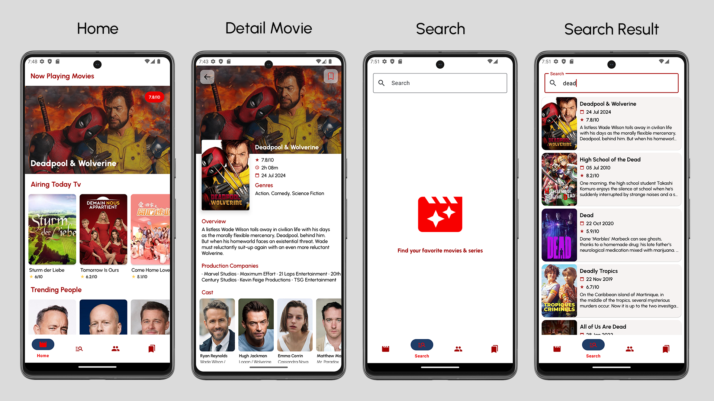
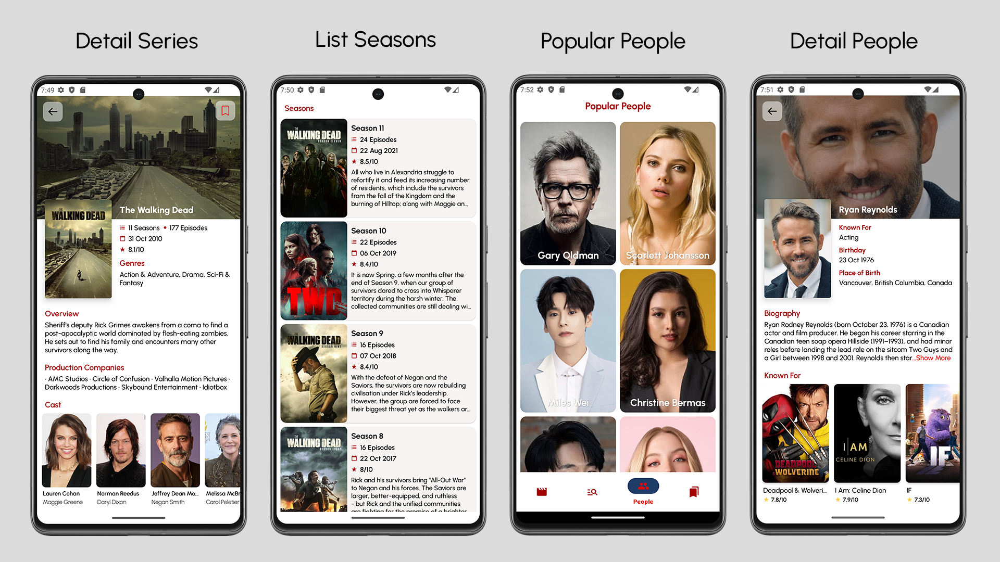
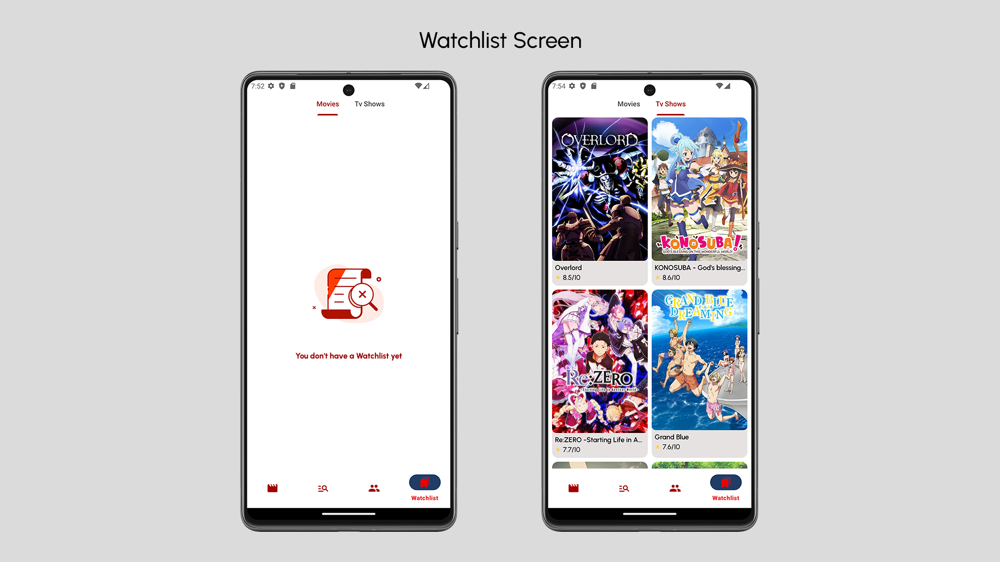
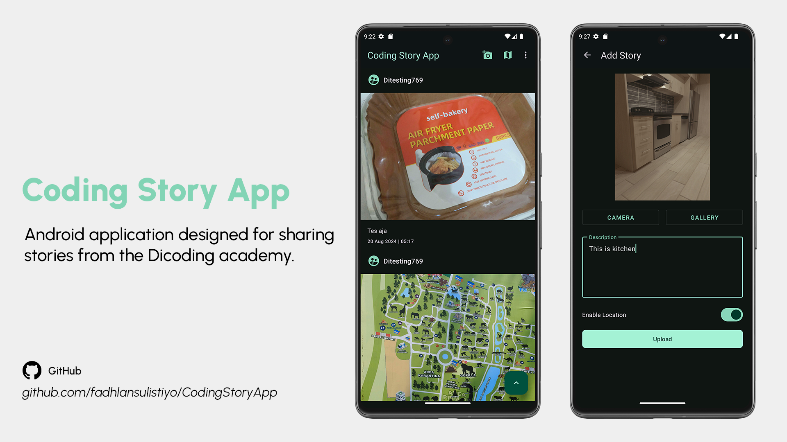
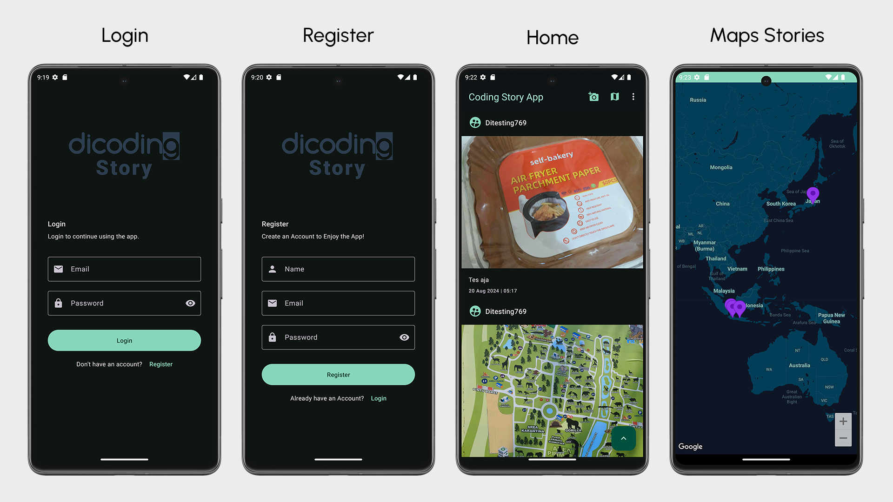
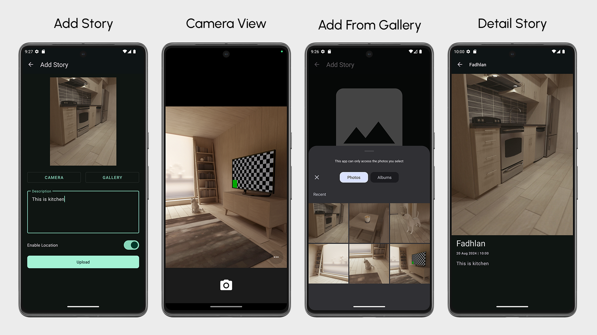

# My Portfolio

Welcome to my Portfolio profile! I am Fadhlan Sulistiyo Hidayat, a passionate Android Developer and an Informatics graduate from Singaperbangsa University Karawang. I thrive on creating innovative and efficient Android applications, constantly learning, and growing in the field of mobile development.

## 🌟 Projects

### Cinema Database (CinDes)

Cinema Database (CinDes) is an Android application that showcases a collection of movies and TV shows, with data sourced directly from the TMDB API. Users can easily browse through popular titles, access detailed information, and discover new content. CinDes features a user-friendly interface, designed to provide a smooth and engaging browsing experience.

#### Features
- Browse Movies & TV Shows: Explore a vast collection of popular and top-rated movies and TV shows.
- Detailed Information: View comprehensive details about each title, including synopsis, release date, ratings, and more.
- Trending & Popular People: Discover trending and popular actors, directors, and other celebrities, with detailed profiles for each.
- Search Functionality: Quickly find specific movies, TV shows.
- Responsive UI: Enjoy a smooth and intuitive user interface, optimized for various screen sizes.
- Watchlist: Add movies and TV shows to your watchlist for easy access later.
- Offline Access: Access previously viewed content on the home screen even without an internet connection.

#### Tech Stack

- **Clean Architecture**: Organized into Data, Domain, and Presentation layers for modularity and separation of concerns.
- **Kotlin**: Primary programming language used for developing the application.
- **Dynamic Feature**: Implements a dynamic feature module for the Watchlist feature.
- **Library Module**: Core functionality is encapsulated within a reusable library module.
- **Coroutines**: Manages asynchronous programming.
- **Data Stream (Coroutines Flow)**: Streams asynchronous data.
- **Hilt**: Dependency Injection framework for managing app components.
- **Retrofit**: Type-safe HTTP client for API communication.
- **Room**: Local database solution for managing app data.
- **SQLCipher**: Adds encryption to the local database for enhanced security.
- **Jetpack Navigation Component**: Manages in-app navigation, including Bottom Navigation.
- **Glide**: Image loading and caching library.
- **ViewPager2**: Enhanced ViewPager for swiping movies.
- **Paging**: Handles efficient data pagination for lists.
- **ProGuard**: Obfuscation tool used to protect the app code.
- **Certificate Pinning**: Ensures secure connections by pinning SSL certificates.
- **Lottie**: Library for rendering animations.
- **Shimmer**: Adds shimmer effects to UI components.
- **LeakCanary**: Tool for detecting memory leaks during development.
- **ShowMoreText (by Sanjay Prajapat)**: Custom view for showing expandable text.

#### Screenshots

##

### Coding Story App 

This is an Android application designed for sharing stories from the Dicoding academy. The application retrieves data using the Dicoding API and integrates various modern Android development technologies.

#### Features

- **Stories Sharing**: Share your stories from the Dicoding academy.
- **Maps Stories**: View stories on a map, enabled by the Google Maps API.
- **Data Persistence**: Utilizes Room for local database management.
- **Pagination**: Implements Paging 3 library with RemoteMediator and Remote Keys.
- **Networking**: Uses Retrofit for networking.
- **State Management**: LiveData for observing data changes.
- **Preferences and Token Storage**: DataStore for managing user preferences and storing login tokens.
- **Dependency Injection**: Service Locator pattern for dependency injection.
- **Location Services**: Integrated with FusedLocationProviderClient for location-based features.
- **Coroutines**: Manages asynchronous operations using Kotlin Coroutines.

#### Tech Stack
- **Material Design Components**: `com.google.android.material:material`
- **Room Database**: `androidx.room:room-runtime`, `androidx.room:room-ktx`
- **Paging 3**: `androidx.paging:paging-runtime-ktx`
- **Retrofit**: `com.squareup.retrofit2:retrofit`, `com.squareup.retrofit2:converter-gson`
- **LiveData**: `androidx.lifecycle:lifecycle-livedata-ktx`
- **DataStore**: `androidx.datastore:datastore-preferences`
- **Google Maps API**: `com.google.android.gms:play-services-maps`
- **FusedLocationProviderClient**: `com.google.android.gms:play-services-location`
- **Kotlin Coroutines**: `org.jetbrains.kotlinx:kotlinx-coroutines-core`, `org.jetbrains.kotlinx:kotlinx-coroutines-android`

#### Screenshots 

 
##

  

## 📚 Coding Academy Graduate
I have completed several courses to enhance my Android development skills. Below are the courses I have completed along with their credential IDs:

- **Menjadi Android Developer Expert**  
  Credential ID: [EYX4V50RWZDL](https://www.dicoding.com/certificates/EYX4V50RWZDL)
- **Belajar Pengembangan Aplikasi Android Intermediate**  
  Credential ID: [1RXYL3NLKPVM](https://www.dicoding.com/certificates/1RXYL3NLKPVM)
- **Belajar Fundamental Aplikasi Android**  
  Credential ID: [1OP8WVLG2XQK](https://www.dicoding.com/certificates/1OP8WVLG2XQK)
- **Belajar Membuat Aplikasi Android untuk Pemula**  
  Credential ID: [07Z68N5GMXQR](https://www.dicoding.com/certificates/07Z68N5GMXQR)
- **Memulai Pemrograman dengan Kotlin**  
  Credential ID: [4EXG4LMD9PRL](https://www.dicoding.com/certificates/4EXG4LMD9PRL)
- **Belajar Prinsip Pemrograman SOLID**  
  Credential ID: [GRX5OMKNRP0M](https://www.dicoding.com/certificates/GRX5OMKNRP0M)
- **Belajar Membuat Aplikasi Flutter untuk Pemula**  
  Credential ID: [0LZ0DRY5RX65](https://www.dicoding.com/certificates/L4PQM1JN7ZO1)
- **Memulai Pemrograman dengan Dart**  
  Credential ID: [0LZ0DRY5RX65](https://www.dicoding.com/certificates/0LZ0175DQP65)

## 🎓 Education
- **Bachelor's Degree in Informatics**  
  Singaperbangsa University Karawang

## 💼 Professional Role
- **Android Developer**

## 🌐 Connect with Me
Feel free to connect with me on social media:
- [LinkedIn](https://linkedin.com/in/fadhlansulistiyo)
- [Instagram](https://instagram.com/fadhlansulistiyo)

## 🛠️ Technologies & Tools

## 📧 Contact
For any inquiries, feel free to reach out to me at [fadhlansulistiyo@gmail.com](mailto:fadhlansulistiyo@gmail.com).

Thank you for visiting my profile! Let's build something amazing together.
